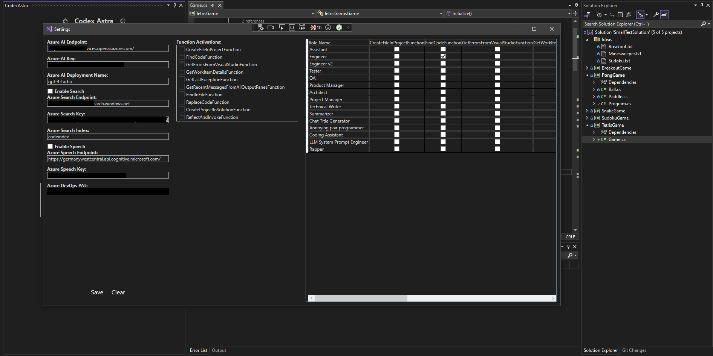

# CodexAstra
CodexAstra is a Visual Studio Extension designed to enhance your coding experience through AI-assisted interactions. Engage in intelligent conversations with AI agents that provide real-time assistance directly within your IDE.

## Features
- **AI-Powered Chat**: Interact with AI agents to gain insight and assistance with your coding tasks. Use the chat window within Visual Studio to ask questions and receive guidance.

- **Agent-Based Support**: Leverage a variety of agents, each specialized in different aspects of software development. Choose the agent that best suits the task at hand.

- **Visual Studio Integration**: Enjoy a seamless experience that brings AI capabilities right into your development workflow. Codex Astra integrates directly into Visual Studio, making it easily accessible.

- **Bring Your Own Deployment**: Maintain confidentiality and control over your data with the ability to deploy Codex Astra to your own Azure AI instance. No data leaves your instance, ensuring privacy and security.

## Getting Started
To start using CodexAstra, follow these simple installation steps:

1. Open Visual Studio.
2. Go to Extensions -> Manage Extensions.
3. Search for "CodexAstra" and click "Download" or "Install".
4. Restart Visual Studio if prompted.

Once installed, open Visual Studio, and you’ll find CodexAstra in the toolbar:

- Find the window under View -> Other Windows -> Codex Astra (or Ctrl+Q -> "Codex Astra")

- Configure your settings by clicking the settings icon next to the title.

Click "New Chat" to start a coding-related chat or use the dropdown to select specific tasks.
### Daily Usage

Codex Astra is designed to streamline your development workflow by facilitating an interactive and productive dialogue with your codebase and development environment. Below are common daily usage scenarios that describe how to interact with and leverage the capabilities of Codex Astra effectively.

#### Get Work Item Details
When you start your day, you might want to get the details of a specific work item from Azure DevOps to prioritize tasks. Simply ask Codex Astra for the work item details:

- Use a prompt like "Get details for work item #12345."
- Codex Astra will fetch all the relevant details, facilitating your planning for the day.

#### Retrieve Existing Code
Before making changes, you may need to review existing code. Codex Astra can help by locating the code associated with a specific class or method:

- Phrase your request as "Show me the code for the `PaymentProcessor` class."
- Codex Astra will use its code search function to retrieve the source code, enabling you to proceed with informed changes.

#### Implement Changes
Once you've reviewed the work items and existing code, you might want Codex Astra to assist with implementing changes:

- Prompt it with "Implement a new method in `PaymentProcessor` for transaction validation."
- Codex Astra can draft code snippets or offer suggestions for the best practices to follow.

#### Work Iteratively
Development is an iterative process. Codex Astra supports this by enabling you to refine solutions through continuous interaction:

- Engage in a dialogue, refining the prompts based on previous outputs, like "Refine the validation method to include currency check."
- Iterate with Codex Astra until you reach a satisfactory solution.

#### Copy/Paste Answers
Once you're happy with the suggestions or code presented by Codex Astra:

- Copy the relevant outputs directly from the interface.
- Paste and integrate them into your project files or use them as a reference for manual coding.

#### Generate Commit Message
Good commit messages are crucial for maintainable version control history. Codex Astra can help generate meaningful commit messages based on the task info and the changes made:

- Instruct it with "Create a commit message for the changes made in `PaymentProcessor` based on task #12345."
- Use the generated message to commit your changes, ensuring your commit logs are informative and traceable to specific work items.

#### Best Practices
To make the most of your day with Codex Astra, here are some best practices:

- **Be Specific**: The more specific you are with your prompts, the more accurate and relevant Codex Astra's responses will be.
- **Follow Patterns**: Establish a pattern of prompts for common tasks, which can save you time and help standardize your interactions with Codex Astra.
- **Review and Adapt**: Always review Codex Astra’s output for accuracy and adapt it to fit the context of your project.
- **Automate When Possible**: Take advantage of Codex Astra's functions to automate repetitive tasks like code refactoring or fetching work item details.

By incorporating these steps into your daily routine, you'll enhance your productivity, reduce manual overhead, and make your development process more efficient and enjoyable. Codex Astra is here to help you every step of the way, from planning to coding to documentation.
### Technical Usage

#### Example Usage Scenarios

Here are a couple of scenarios exemplifying how you could use natural language prompts to interact with CodexAstra functions:

1. **File Creation**
   - User Prompt: "Create a new file for the MathLibrary project."
   - Action: The `CreateFileInProjectFunction` would be invoked to create a file in the specified "MathLibrary" project.

2. **Code Search**
   - User Prompt: "Look at my MathOperations class."
   - Action: The `FindCodeFunction` would be used to find and display the source code for the "MathOperations" class.

3. **Retrieving Errors**
   - User Prompt: "Show me the errors from my last build."
   - Action: The `GetErrorsFromVisualStudioFunction` would be executed to return the error list from the most recent build performed.

4. **Code Replacement**
   - User Prompt: "Replace 'int' with 'long' in all my variable declarations."
   - Action: The `ReplaceCodeFunction` would be activated to replace instances of 'int' with 'long' across all variable declarations in the current solution.

#### Best Practice for Command Phrasing

When phrasing commands, be clear and precise. The system is designed to understand and respond to key terms and contexts that relate to the functions provided. Unclear or ambiguous prompts may result in unwanted actions or the need for further clarification.

To optimize your interaction, ensure that your prompts:
- Include the name or type of the entity (file, project, class, function, etc.) you are referring to.
- Specify any additional context where possible (e.g., project name, class name, variable types).
- Avoid using vague terms or incomplete sentences that lack actionable information.

By following these guidelines, you can streamline your work process and effectively leverage the capabilities of the CodexAstra functions.

